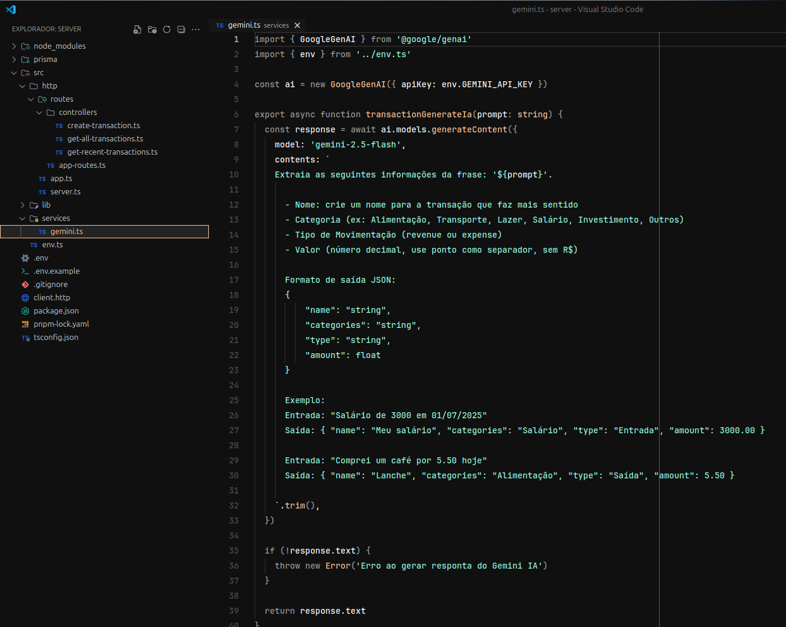

Claro! Aqui está uma versão mais profissional e organizada do seu README:

---

# 💰 IA Finanças - Gemini

Este repositório contém o projeto **IA Finanças**, desenvolvido com o objetivo de facilitar a criação de movimentações financeiras pessoais por meio de inteligência artificial. Utilizando a **Gemini IA do Google**, o sistema permite que os usuários registrem movimentações de forma simples e rápida, a partir de prompts em linguagem natural.



---

## 📌 Sobre o Projeto

O projeto foi criado para automatizar o processo de lançamento de movimentações financeiras. Em vez de preencher diversos campos manualmente, o usuário pode simplesmente digitar um prompt com as informações desejadas. A inteligência artificial processa esse prompt e retorna um objeto JSON com os dados estruturados, prontos para serem salvos no banco de dados.

---

## 🚀 Tecnologias Utilizadas

- [Node.js](https://nodejs.org/)
- [TypeScript](https://www.typescriptlang.org/)
- [Fastify](https://www.fastify.io/)
- [Prisma ORM](https://www.prisma.io/)
- [Gemini AI - Google](https://deepmind.google/technologies/gemini/)

---

## 🛠️ Como Executar o Projeto

### 1. Clone o repositório

```bash
git clone https://github.com/brunogoncalvesferreira/finance-gemini.git
```

### 2. Acesse o diretório do projeto

```bash
cd finance-gemini/server
```

### 3. Instale as dependências

```bash
npm install
```

### 4. Configure as variáveis de ambiente

Crie um arquivo `.env` na raiz da pasta `server` e adicione sua chave da API Gemini:

```env
GEMINI_API_KEY="sua_chave_aqui"
```

### 5. Inicie o servidor em ambiente de desenvolvimento

```bash
npm run dev
```

---

## 📄 Licença

Este projeto está licenciado sob a [MIT License](LICENSE).

---
